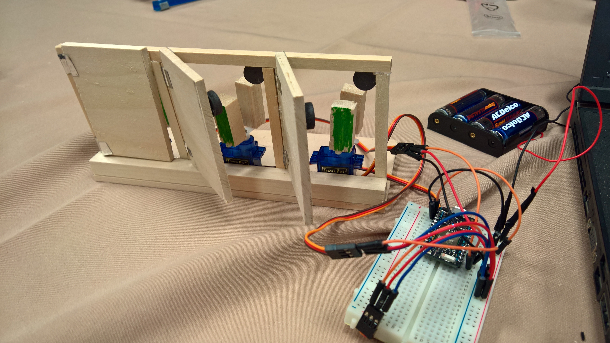

#Monty Hall Gameshow Simulator with Johnny Five

Most of my professional career is spent making software. But when I found out that there was a full working maker space at the CodeMash16 conference, I decided to build something. Because, you know, software is great, but Making Is Fun™!




The NodeBot session handed us a bag of parts, some easy starting point tutorials and ample tools and materials. Among the parts was a [Photon](https://store.particle.io/collections/photon) board, and a hello-world JavaScript file that used [johnny-five](https://www.npmjs.com/package/johnny-five) robotic framework, and [particle-io](https://www.npmjs.com/package/particle-io) libraries.

Rather than building a push bot, I decided to go "off-script" and build a Monty Hall simulator. The specs for the simulator were pretty straightforward and I figured I could knock it out in a few hours.

The Monty Hall game show is played by a contestant and a game show host. The contestant chooses 1 of 3 closed doors. She is told that one of the door hides the grand prize (Bacon!) and the other two, a lesser prize (Broccoli). After she chooses a door, the host opens one of the two remaining doors, revealing the lesser prize. The contestant now has a second choice, and is allowed to choose whether to stick with her original door choice ("stick") or choose the other closed door ("switch"). Once she chooses, that final door is opened. As it turns out, there's a strategy to winning the game more often, which you can read about [here](https://en.wikipedia.org/wiki/Monty_Hall_problem). 

I decided to build three doors out of craft wood. The door hinges were simply duct tape. To keep the door closed, I glued a small magnet on the inside of the door panel, and another to the door frame, which kept the outside of the door clean.

To open the door and reveal the "prize", placed a small RC servo with the arm in parallel to the door panel. When the servo would turn 90 degrees one way, or the other, it would bump the door open. On each side of the servo arm, I placed a little piece representing bacon or broccoli. So each door had the potential to be either prize. 

With this setup, I went to write the software. Using node made things very easy: npm took care of all the dependencies, which really just included johnny-five and particle-io. I declared the 3 servos corresponding to the 3 digital pins D0, D1, and D2. Since the RC servos were tiny, I could wire them directly to the Proton board, and didn't need any extra hardware. Since these were RC servos, their notion of zero, 180 etc was not extremely accurate. But since there was enough space between the servo arms in "center" position to the doors, it didn't matter. The servos were initialize to be centered 
```javascript
// initializing the 3 servos on digital pins 0,1,2. The 'D' is ignored, but is easier for me to read ad being digital rathern than analog pins.
    _servos = [
        new five.Servo({ pin: 'D0', center: true }),
        new five.Servo({ pin: 'D1', center: true }),
        new five.Servo({ pin: 'D2', center: true })
    ];
```

To hold the game state, I created an object which had the 3 prizes. All initialized to have a "broccoli" prize, each attached to one servo. Game initialization then picked one at random and marked it a winner (silently, not telling the user) so it will have the "bacon" prize. Having the door include both a string prize field and an _isWinner boolean field made coding and debugging a bit easier. 

The main game loop used process.stdin "keypress" event to collect user input directly. The rest of the program had to do very little hardware control. A "broccoli" prize - upon being activated - would turn to the minimum position. A "bacon" prize would reveal using the maximum servo position.
```javascript
    var _show = function () {
        if (_isWinner) { 
            _servo.max(); 
        }
        else { 
        _servo.min();
        }
    };
```

Game logic would simply call "show" on the selected prize and it would reveal the prize by turning the servo.

Overall, the project was a delightfully smooth build. The proton board just worked. Using johnny-five and particle-io libraries together made the servo control a cinch. All I had to do is initialize Servo abstraction over the correct digital pins and it just worked. Commanding the servos didn't require any pulsing or math either, since my hardware build just used the 3 logical positions min, max, and center. I did take extra care to ensure the wiring of the Tower Pro SG90 servo to the Proton board was correct, so that I didn't short the pin to GND or something silly. 

Playing the game multiple times in a row initially, I happened to always win using the "switch" strategy, and my friend repetitively lost using the "stick" strategy. So much so, that we suspected a bug. But that was just a streak. After a while, the odds demonstrated were closer to the expected random distribution for the respective strategies. One bug I did find is that the "host" (played by the software) was choosing the first non-winning door of the 2 remaining, not a random door. This turned out to be a revealing hint (if you noticed that the host always picked door 1 or 2…). I later fixed it to choose a door at random. The Javascript Math.random() function is not cryptographically very strong, but was good enough for this project.
